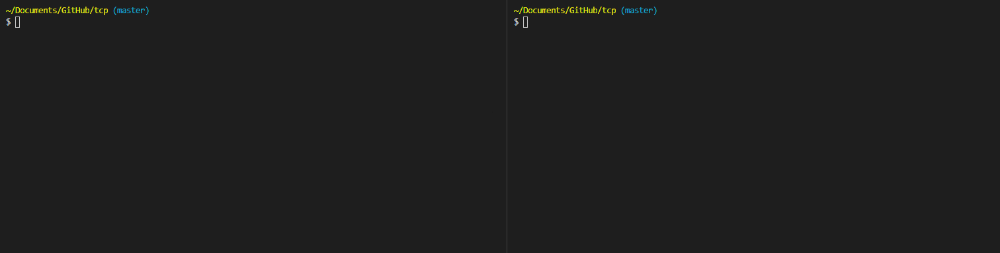

# Node.js Net Server and Client



## Simple Node.js server and client that uses the [Net](https://nodejs.org/api/net.html) module.

## Run with Docker

Run a server with Docker by running the following command:

```
docker run --rm -p 1337:1337 --env IP_ADDRESS=0.0.0.0 --env MODE=server -d razermoon/nnsc:latest
```

[Here is the Docker repo](https://hub.docker.com/r/razermoon/nnsc)
## Build
Compile:

```
yarn compile
```

Start server:

```
yarn server
```

Start client:

```
yarn client
```

Rename the .env.example to .env and fill out the fields for custom ip.

You can also download the lastest release.
